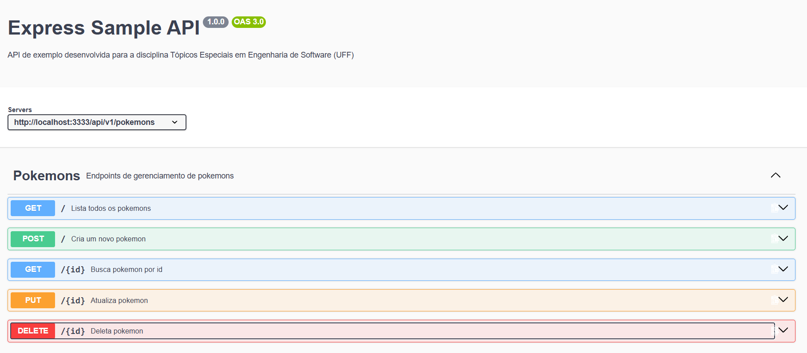
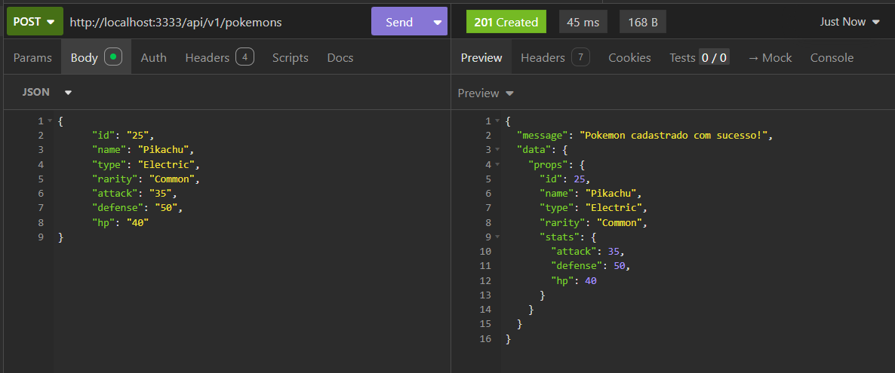
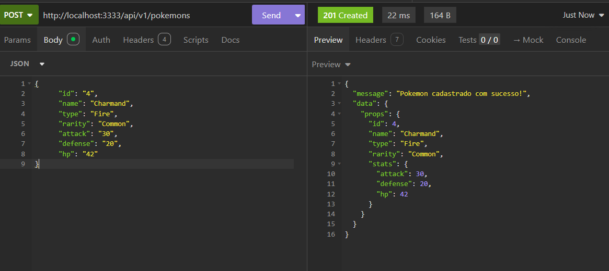
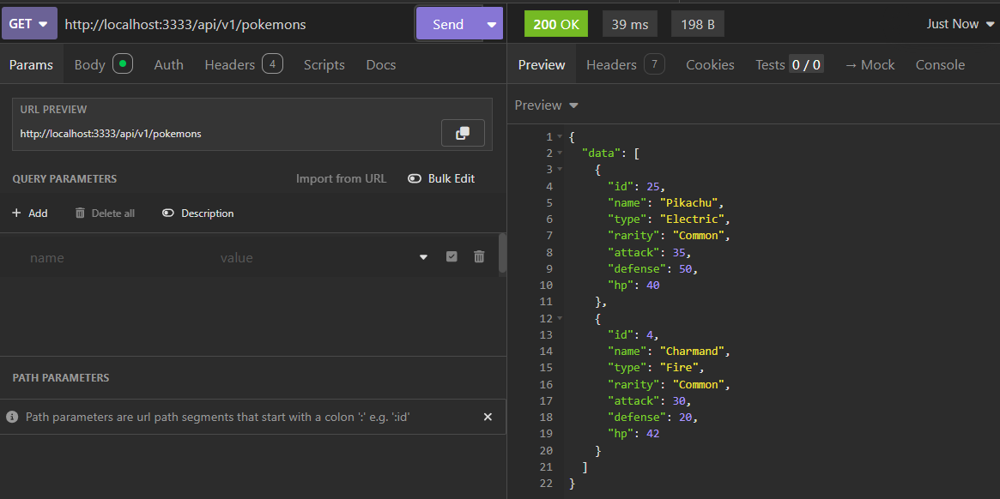
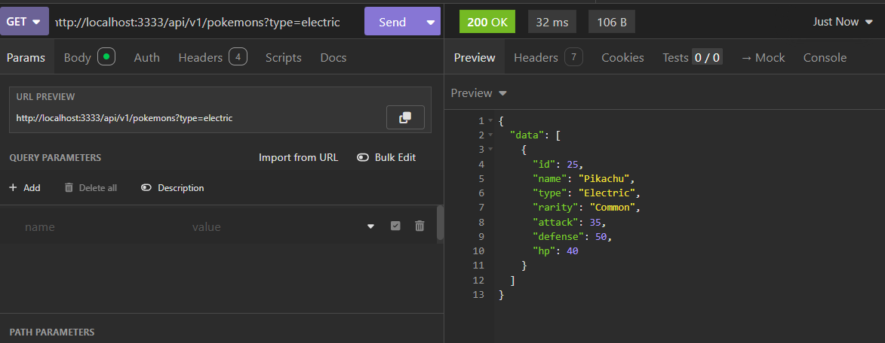
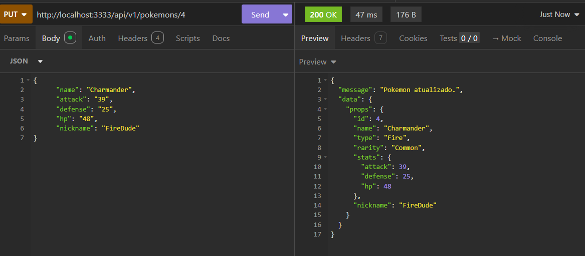
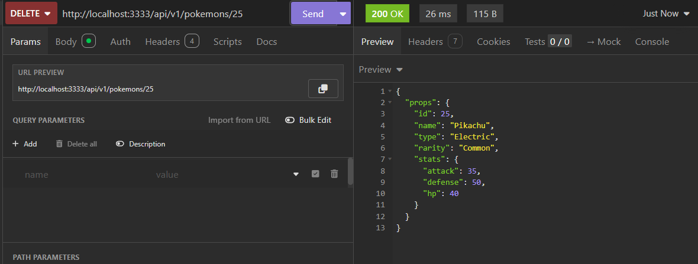

# 🎮 PokéManager API — Módulo 1


API RESTful para gerenciamento do catálogo e times de Pokémons desenvolvida na disciplina de **Tópicos Especiais em Engenharia de Software**.

Este repositório contempla a **Entrega 1 (Módulo 1)**, focada no desacoplamento de código via **Clean Architecture**, repositório em memória (_In-Memory_), documentação interativa com **Swagger** e tratamento global de erros.



---

## 🏛️ Arquitetura do Projeto

O projeto segue os princípios da **Clean Architecture (Arquitetura Limpa)**, garantindo independência de frameworks, testabilidade e separação clara de responsabilidades:

```text
src/
├── domain/                  # [Camada 1] Entidades de negócio e contratos (Interfaces)
│   ├── entities/            # Regras de negócio puras (ex: Pokemon)
│   ├── errors/              # Exceção de domínio (AppError)
│   └── repositories/        # Contrato IPokemonRepository
│
├── application/             # [Camada 2] Casos de Uso (Lógica de Aplicação)
│   └── use-cases/           # CreatePokemon, ListPokemons, GetPokemonById, DeletePokemon, updatePokemon.
│
├── infrastructure/          # [Camada 3] Frameworks, Banco de Dados e HTTP
│   ├── database/            # Repositório em memória (InMemoryPokemonRepository)
│   └── http/                # Controllers, Routers e Middlewares do Express
│
└── main/                    # [Camada 4] Ponto de Composição (Setup da Aplicação)
    ├── config/              # Configurações gerais e especificação Swagger/OpenAPI
    ├── factories/           # Instanciação e Injeção de Dependências
    └── server.ts            # Inicialização do Servidor HTTP
```

---

## 🛠️ Tecnologias Utilizadas

- Runtime: Node.js (v20+)
- Linguagem: TypeScript
- Framework Web: Express
- Execução em Dev: tsx
- Documentação: Swagger UI Express + swagger-autogen
- Qualidade/Padrões: ESLint & Prettier

---

## 🚀 Como Executar o Projeto Localmente

Pré-requisitos

- Node.js (v18 ou superior)
- npm ou pnpm instalado

Passo a Passo

```bash

# 1. Clonar o repositório
$ git clone [https://github.com/Pedrolucaspf/pokemon-manager-api.git](https://github.com/Pedrolucaspf/pokemon-manager-api.git)

# 2. Acessar a pasta do projeto
$ cd pokemon-manager-api

# 3. Instalar as dependências
$ npm install

# 4. Executar o projeto em modo de desenvolvimento
$ npm run start

```

O servidor iniciará na porta 3333:

- 🚀 API Base URL: <http://localhost:3333/api/v1>
- 📖 Documentação Swagger: <http://localhost:3333/api/docs>

---

## 📖 Documentação dos Endpoints (RESTful)

A documentação interativa completa está acessível via Swagger no navegador em /api/docs.

| Método | Endpoint             | Descrição                                     | Status de Sucesso |
| ------ | -------------------- | --------------------------------------------- | ----------------- |
| POST   | /api/v1/pokemons     | Cadastra um novo Pokémon no catálogo          | 201 Created       |
| GET    | /api/v1/pokemons     | Lista Pokémons (com suporte a ?type=Electric) | 200 OK            |
| GET    | /api/v1/pokemons/:id | Busca um Pokémon pelo ID                      | 200 OK            |
| PUT    | /api/v1/pokemons/:id | Atualiza os dados de um Pokémon               | 200 OK            |
| DELETE | /api/v1/pokemons/:id | Remove um Pokémon do catálogo                 | 200 OK            |

---

## 🧪 Exemplos de Requisições (cURL)

### Cadastrar Pokémon

```bash

curl --request POST \
  --url http://localhost:3333/api/v1/pokemons \
  --header 'Content-Type: application/json' \
  --data '{
    "id": "25",
    "name": "Pikachu",
    "type": "Electric",
    "hp": "35",
    "attack": "55",
    "defense": "40"
  }'

```

```bash

curl --request POST \
  --url http://localhost:3333/api/v1/pokemons \
  --header 'Content-Type: application/json' \
  --data '{
    "id": "4",
    "name": "Charmand",
    "type": "Fire",
    "hp": "30",
    "attack": "35",
    "defense": "20"
  }'

```

### Listar com Filtro de Tipo

```bash

curl --request GET \
  --url 'http://localhost:3333/api/v1/pokemons?type=Electric'

```

---

### Buscar Pokemon por ID

```bash
  curl --request GET \
    --url http://localhost:3333/api/v1/pokemons/25

```

### Atualizar Pokémon

```bash

  curl --request PUT \
    --url http://localhost:3333/api/v1/pokemons/4 \
    --header 'Content-Type: application/json' \
    --data '{
    "name": "Charmander",
    "hp": "39"
  }'

```

### Excluir Pokémon

```bash
 curl --request DELETE \
    --url http://localhost:3333/api/v1/pokemons/25

```

## 🛡️ Padronização de Erros

A API utiliza a classe AppError e um Middleware Global de Erros, garantindo respostas estruturadas:

```json
{
  "status": "error",
  "statusCode": 404,
  "message": "Pokémon não encontrado no catálogo."
}
```

---

## Exemplos do funcionamento (execução via a aplicação Insomnia)













---

## 👤 Autor

Desenvolvido por Pedro Lucas Portela

Estudante de Ciência da Computação.
